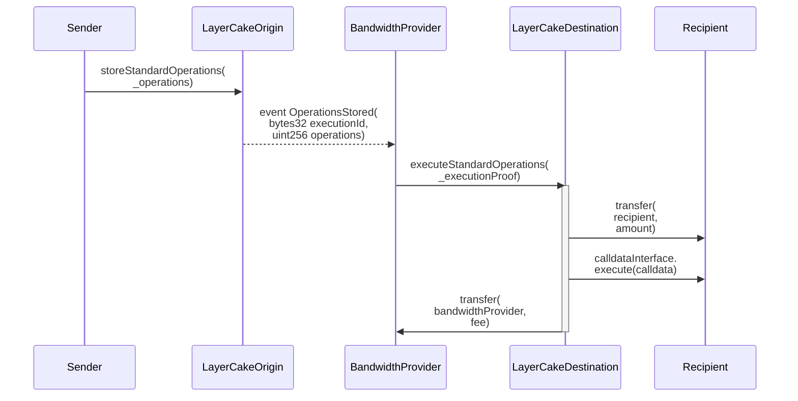
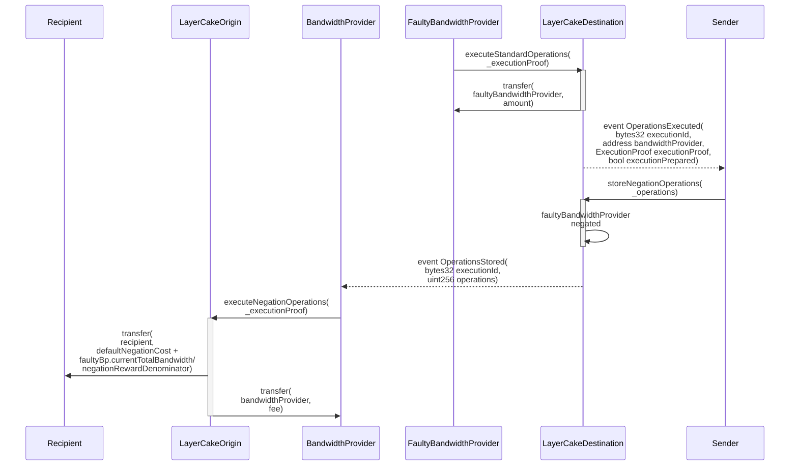

# LayerCake: An insured-in-transit cross-network composability protocol

The key features of LayerCake are:
- Instant transfers as opposed to the delayed transfers of optimistic models.
- Every transfer in LayerCake is insured-in-transit with 1-to-1 backing by the actual asset being transferred. This insurance, called *bandwidth* in the system, covers faulty operator behavior as well as blockchain reorgs that happen to a certain depth, e.g. 6 hours.
- LayerCake has custom code endpoints allowing developers to code automatic actions that complete in the same step that assets are bridged. E.g. any developer can build their own swaps protocol on top of LayerCake.
- There is no governance role or any form of trusted party in the system. Participation in the system is fully based on ownership of the bridged ERC20 token (e.g. WETH) and using it to either operate as a bandwidth provider or engage with the system as a user.
- The system has a bandwidth efficiency of 110% bandwidth locked up, where 100% of the bandwidth can be reused every 12 hours. The 10% lockup and the 12 hours bandwidth period can be customized to any non-zero value for different deployments of the system between different blockchains and for different assets bridged, without impacting the design of the system.
- The system permits anyone to engage in the *bandwidth negation* mechanism, which completes the insurance system without relying on any trusted party.
- The system has a set of verified setup contracts which initializes the LayerCake contracts without any trusted party, and ensures that the system starts with as many available bandwidth providers that are interested to join.
- The footprint of the system is lightweight and fast, and does not leverage any re-running of computation on a destination blockchain that happened on a source blockchain or vice versa, unlike zero-knowledge and optimistic rollup style approaches.

The standard user interaction with LayerCake is depicted below:

The bandwidth negation mechanism is described in the following diagram: 

For complete protocol design information, see the yellow paper linked in the following section.

## Docs

- [Yellow paper](docs/yellow-paper.md)
- [Foundry unit tests](docs/tests.md)
- [Running the LayerCake Rust-based indexer](docs/indexer.md)
- [Slither test results](docs/slither.md)

Copyright (c) 2023, Flare Mainnet Holdings Ltd.
All rights reserved.
