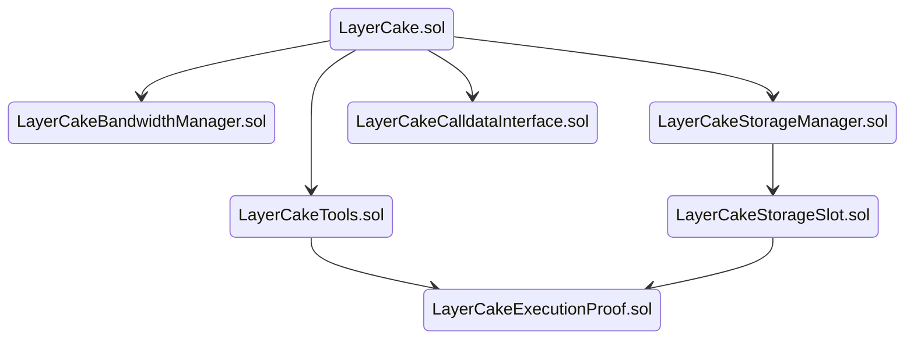
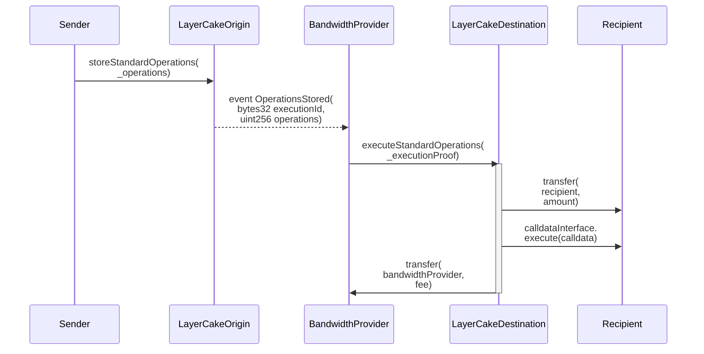
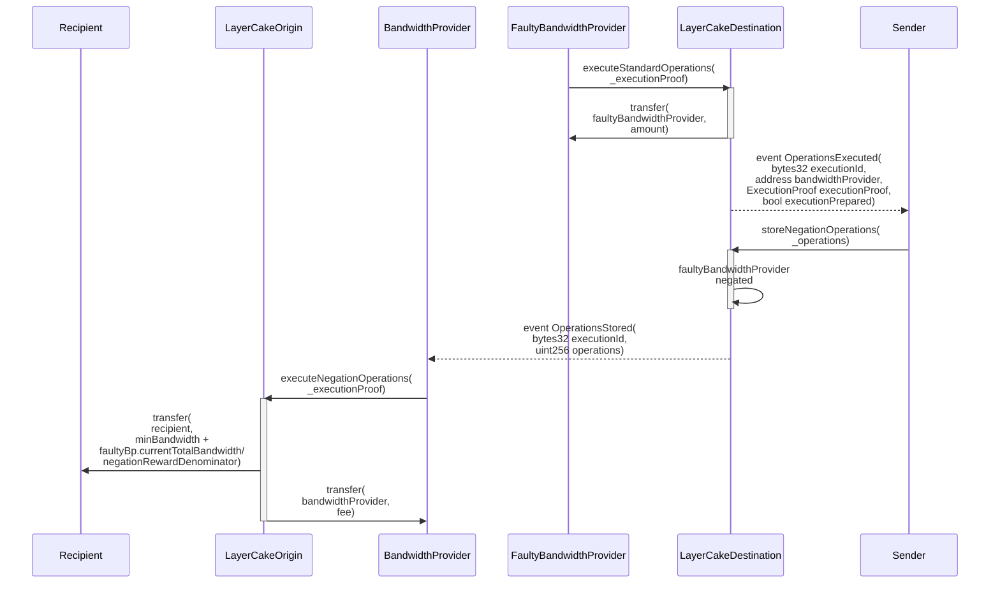
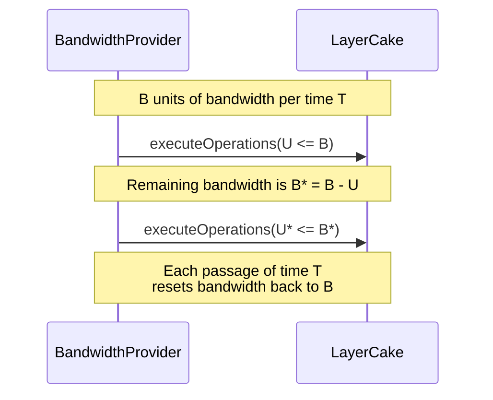
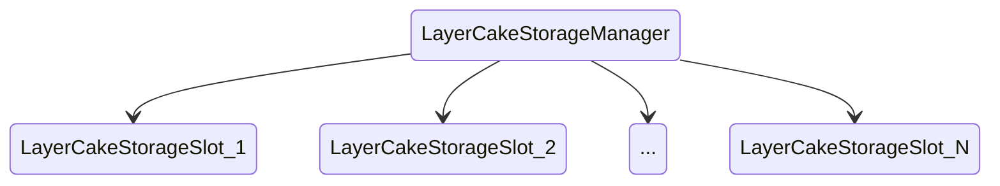

# LayerCake: An insured-in-transit cross-network composability protocol

The key features of LayerCake are:
- Instant transfers as opposed to the delayed transfers of optimistic models.
- Every transfer in LayerCake is insured-in-transit with 1-to-1 backing by the actual asset being transferred. This insurance, called *bandwidth* in the system, covers faulty operator behavior as well as blockchain reorgs that happen to a certain depth, e.g. 6 hours.
- LayerCake has custom code endpoints allowing developers to code automatic actions that complete in the same step that assets are bridged. E.g. any developer can build their own swaps protocol on top of LayerCake.
- There is no governance role or any form of trusted party in the system. Participation in the system is fully based on ownership of the bridged ERC20 token (e.g. WETH) and using it to either operate as a bandwidth provider or engage with the system as a user.
- The system has a bandwidth efficiency of 110% bandwidth locked up, where 100% of the bandwidth can be reused every 12 hours. The 10% lockup and the 12 hours bandwidth period can be customized to any non-zero value for different deployments of the system between different blockchains and for different assets bridged, without impacting the design of the system.
- The system permits anyone to engage in the *bandwidth negation* mechanism, which completes the insurance system without relying on any trusted party.
- The system has a set of verified setup contracts which initializes the LayerCake contracts without any trusted party, and ensures that the system starts with as many available bandwidth providers that are interested to join.
- The footprint of the system is lightweight and fast, and does not leverage any re-running of computation on a destination blockchain that happened on a source blockchain or vice versa, unlike zero-knowledge and optimistic rollup style approaches.

## Contracts

The seven LayerCake contracts are each deployed on two different blockchains: the source chain and the destination chain. The deployments of LayerCake are identical on both chains, except for the ERC-20 asset each deployment references. The source chain references the real ERC-20 asset, and the destination chain references a wrapped representation ERC-20 asset with a supply cap that denotes the deposit cap in the LayerCake system. At deploy time, the destination chain deployment of LayerCake receives the full balance of the wrapped representation ERC-20 supply, such that it can start sending them out on the destination chain upon real ERC-20 assets being deposited on the source chain.



### LayerCake.sol

#### Storing Operations:

The `storeStandardOperations()` function is the primary function that users will interact with in LayerCake. 

```solidity
function storeStandardOperations(
    Operations memory _operations
)
    external
```

Users deposit an `amount` of ERC20 tokens, up to `depositCap` total tokens stored on the LayerCake contract, and specify a `recipient` for the tokens, along with optional custom code `callData` to run on the `recipient` address automatically upon delivery of the tokens on the destination chain. The execution of the `callData` is bounded by an amount of gas `callDataGasLimit` that the user specifies as part of their stored operations. The `nonce` field is used to make the transaction have a unique identifier in the LayerCake contract storage, and in practice is the current nanoseconds timestamp taken client-side by the user. The `fee` field is the amount of tokens that will be delivered to the bandwidth provider that fulfills this deposit request on the destination chain. The value of `executionTime` is set to `block.timestamp` within the call to `storeOperations()` and represents the earliest time that the `_operations` can be executed on the opposite chain.

```solidity
struct Operations {
    uint256 nonce;
    uint256 amount;
    uint256 fee;
    address sender;
    address recipient;
    uint256 executionTime;
    uint256 callDataGasLimit;
    bytes callData;
    bool cancel;
    uint256 cancellationFeeRefund;
    address negatedBandwidthProvider;
    bool initialNegation;
    bytes32 invalidExecutionProofId;
}
```

For each call to `storeOperations()`, a unique `executionId` is generated as follows:

```solidity
bytes32 executionId = getExecutionId(
    departingPathwayId, 
    _operations
);
```

Where `departingPathwayId` is defined as:

```solidity
bytes32 public immutable departingPathwayId = getPathwayId(_thisChainId, _oppositeChainId, _assetId, _contractId);
```

and represents a unique pathway ID from the current chain to the opposite chain for this particular asset. `_contractId` represents the fact that multiple LayerCake bridges can operate in parallel for a particular source chain, destination chain, and asset.

Similarly, `arrivingPathwayId` is defined as:

```solidity
bytes32 public immutable arrivingPathwayId = getPathwayId(_oppositeChainId, _thisChainId, _assetId, _contractId);
```

Note that on the source chain, the `departingPathwayId` equals the `arrivingPathwayId` of the destination chain and vice versa. These pathway IDs are used in order to keep the `executionId` values unique to this particular pair of LayerCake contracts so that its storage and proofs are unique to it. 

Once the `executionId` is generated, it is first checked that it's unique, and it is then saved to storage using:

```solidity
storageManager.storeExecutionId(_operations.executionTime, executionId, _operations.sender, _operations.amount);
```

#### Executing Operations:

The `executeOperations()` function is only permitted to be called by bandwidth providers that have at least `partialAmount` available bandwidth in the system, which is proven using the function `bandwidthManager.proveBandwidth(msg.sender, bandwidthUsed)`. Calling `executeOperations()` is a competitive process where the first bandwidth provider to successfully execute the call to `executeOperations()` wins the right to fulfill the user's corresponding call to `storeOperations()` on the opposite chain.

```solidity
function executeStandardOperations(
    ExecutionProof memory _executionProof
)
    external
```

The inputted fields to `executeOperations()` match the corresponding call to `storeOperations()` on the opposite chain plus additional fields, all contained in the `ExecutionProof memory _executionProof` struct. The `ExecutionProof` struct is defined as:

```solidity
struct ExecutionProof {
    Operations operations;
    uint256 partialAmount;
    uint8 v;
    bytes32 r;
    bytes32 s;
}
```

Where `v`, `r` and `s` are elements of a signature over `executionId` using the private key corresponding to the bandwidth provider issuing the call to `executeOperations()`. This signed `executionId` must match the `executionId` generated by the inputted fields to `executeOperations()` in order for its execution to succeed. This means that the bandwidth provider leaves behind a succinct proof that it authorized this execution, which can be used against them if the executed operations did not have valid corresponding stored operations.

Bandwidth providers can partially fill a request by specifying `partialAmount < amount`. If a bandwidth provider specifies a `partialAmount` that is greater than the remaining amount to be filled for a request, then the bandwidth provider is only debited the remaining value of the request from their bandwidth, and not the entire value of `partialAmount`. Partial fees are paid proportional to each bandwidth provider's contribution to filling a request, and based on the current user-increased fee at the time of each call to `executeOperations()`. The total value of the request is transferred and the custom code is called on the `recipient` contract using `recipientCalldata` at the moment when the request is completely filled.

The full storage and execution flow is depicted below:



#### Cancelling Operations

A user may cancel their stored operations if they have not already been fully executed by calling `cancelStandardOperations()` on the destination chain where they would have been executed:

```solidity
function cancelStandardOperations(Operations memory _operations) external nonReentrant
```

This creates a valid execution on the chain where the user stored the operations that returns the `amount` they deposited, minus any already spent fees towards partial execution on the destination chain, and minus a fee to a bandwidth provider on the origin chain for executing the cancel operations by calling `executeCancelStandardOperations()`.

```solidity
function executeCancelStandardOperations(ExecutionProof memory _executionProof) external nonReentrant
```

#### Increasing Fees

Users may increase their fee on the chain they are expecting to have their operations executed on by calling `increaseFee()`.

```solidity
function increaseFee(
    bytes32 _executionId,
    uint256 _executionTime,
    uint256 _addedFee
) 
    external 
    nonReentrant 
```

#### Adding and Subtracting Bandwidth

Anyone may at any time add new bandwidth to the system by calling `addBandwidth()`:

```solidity
function addBandwidth(
    uint256 _bandwidthAmount
)
    external
```

This deposits `_bandwidthAmount + _bandwidthAmount/bandwidthDepositDenominator` tokens and gives the sender `_bandwidthAmount` new bandwidth that they can immediately start operating with on the chain that this deposit occurs. `_bandwidthAmount/bandwidthDepositDenominator` is a deposit of tokens which are held as an incentive to leave the system in the correct manner by using the `subtractBandwidth()` function. If the bandwidth provider leaves the system in any other manner, e.g. using `executeOperations()` without a corresponding valid `storeOperations()`, then they lose this deposit. Bandwidth providers must maintain a bandwidth of between `minBandwidth` and `minBandwidth * MAX_BANDWIDTH_MULTIPLE` in order to operate in the system, where `MAX_BANDWIDTH_MULTIPLE` is a constant e.g. 1000. 

```solidity
function subtractBandwidth(
    uint256 _bandwidthAmount
)
    external
    nonReentrant
```

If a bandwidth provider calls `subtractBandwidth()` for an amount `_bandwidthAmount`, then their bandwidth is first proven to be available and then spent using the same `proveBandwidthPrivate()` function as during a call to `executeOperations()`. Then the bandwidth provider's `currentTotalBandwidth` is reduced by `_bandwidthAmount` and they are sent `_bandwidthAmount + _bandwidthAmount/bandwidthDepositDenominator` tokens. 

The storing of `_bandwidthAmount + _bandwidthAmount/bandwidthDepositDenominator` tokens while only being permitted to access `_bandwidthAmount` tokens per `bandwidthPeriod` time is done in order to reward bandwidth _negation_, which is a way to remove faulty bandwidth providers from the system, described in a later section below.

#### Proof Function:

The validity of a call to `executeOperations()` can be checked on the opposite chain by calling `getExecutionValidity()` with the signed `_executionProof` that the bandwidth provider would have had to sign to perform the execution call.

```solidity
function getExecutionValidity(
    address _bandwidthProvider,
    bytes32 _executionId,
    ExecutionProof memory _executionProof
)
    public
    view
    returns (bool)
```

This call is performed on the chain where the user's call to `storeOperations()` should have occurred, and it checks that the execution corresponds to a valid stored set of operations. In order for the call to succeed, 

```solidity
storageManager.getExecutionIdStored(_executionProof.operations.executionTime, _executionId)
```

must return false, and

```solidity
recoverSigner(_executionId, _executionProof) == _bandwidthProvider
```

must return true.

#### Bandwidth Negation

In order to complete the insurance proving system, a concept called _negation_ is introduced. When a bandwidth provider issues an invalid execution on a chain, anyone may compete to call `storeNegationOperations()` on that chain. This sets the bandwidth provider's bandwidth amount to be multiplied by -1, effectively causing it to have no available bandwidth in the system while it remains negative.

```solidity
function storeNegationOperations(
    Operations memory _operations
)
    external
    nonReentrant
```

Within the above `_operations` struct, `negatedBandwidthProvider` is the bandwidth provider that performed the invalid execution, `initialNegation` is set to true, `invalidExecutionProofId` is the hash of the invalid execution performed by the bandwidth provider and `amount` is set to the value of `minBandwidth`.

This call to `storeNegationOperations()` deposits `minBandwidth` tokens from the sender, but updates the value of `_operations.amount` to be equal to `minBandwidth + bp.currentTotalBandwidth/negationRewardDenominator` before storing the operations on this chain. This in effect charges the sender `minBandwidth` tokens, but authorizes an execution of a higher value on the opposite chain for that sender. This is possible because on the opposite chain where the corresponding negation execution is performed, it is required that the referenced execution proof is invalid before permitting the transfer of `minBandwidth + bp.currentTotalBandwidth/negationRewardDenominator` to the account that stored the negation operations. 

`negationRewardDenominator` is equal to `2 * bandwidthDepositDenominator`, i.e. if the bandwidth deposit percentage is 10% of the total added bandwidth, then the negation reward percentage is 5% of the total negated bandwidth.

The amount of tokens `bp.currentTotalBandwidth/negationRewardDenominator` used as the reward here is drawn from the deposited `_bandwidthAmount + _bandwidthAmount/bandwidthDepositDenominator` described above where a bandwidth provider only has access to `_bandwidthAmount` tokens each `bandwidthPeriod` amount of time, and is assumed to have incorrectly spent `_bandwidthAmount` tokens such that the remaining amount of `_bandwidthAmount` tokens are used for the negation reward. 

```solidity
function executeNegationOperations(
    ExecutionProof memory _negationExecutionProof,
    ExecutionProof memory _invalidExecutionProof
) 
    external
    nonReentrant
```

In the above call to `executeNegationOperations()`, `_negationExecutionProof` is the set of operations that were stored in the call to `storeNegationOperations()`, and `_invalidExecutionProof` is the full invalid execution proof signed by the negated bandwidth provider. 

```solidity
bytes32 invalidExecutionProofId = getInvalidExecutionProofId(_invalidExecutionProof);
require(invalidExecutionProofId == _negationExecutionProof.operations.invalidExecutionProofId);
bytes32 invalidExecutionId = getExecutionId(
    departingPathwayId, 
    _invalidExecutionProof.operations
);
bool executionValidity = getExecutionValidity(
                                _negationExecutionProof.operations.negatedBandwidthProvider,
                                invalidExecutionId,
                                _invalidExecutionProof);
require(_negationExecutionProof.operations.initialNegation != executionValidity);
```

In the above set of code from the function `executeNegationOperations()`, it is first checked that the `_invalidExecutionProof` is referenced in the `_negationExecutionProof` by requiring a matching `invalidExecutionProofId`. Then the validity of the `_invalidExecutionProof` is required to be false if `_negationExecutionProof.operations.initialNegation` equals true. This means that if the bandwidth provider had its bandwidth made negative, then this proof requires that it actually performed an invalid execution.

For a cost of `minBandwidth` tokens, the sender of the `storeNegationOperations()` call earns `minBandwidth + bp.currentTotalBandwidth/negationRewardDenominator`, which incentivises anyone to compete to be the first to call `storeNegationOperations()` upon a bandwidth provider performing an invalid action.

The full negation flow is depicted below:



Suppose that the bandwidth provider did not actually perform any invalid execution, but they were negated by a sender calling `storeNegationOperations()`. The bandwidth provider would be negated, but the sender's call to `executeNegationOperations()` on the opposite chain would fail because `_negationExecutionProof.operations.initialNegation == executionValidity`, i.e. `initialNegation` is true and the referenced `_invalidExecutionProof` is actually valid.

To reverse the negation, the bandwidth provider can also call `storeNegationOperations()`, with the differences being `initialNegation = false` and `amount = negatedBandwidthProvider.currentTotalBandwidth`, i.e. the bandwidth provider instructs that it is setting its bandwidth to be negated again (to become positive) and it deposits the same amount as its total bandwidth in the system that is currently negated. This creates a valid call to `executeNegationOperations()` where the bandwidth provider earns back their total bandwidth as well as the `minBandwidth` that was deposited by the original sender that initially negated the bandwidth provider. The bandwidth provider's bandwidth is now positive again such that it can resume operation after one bandwidth period, and they gain money through this process of being challenged but succeeding.

Note that the pair of calls to first store a negation that makes bandwidth negative and then positive must be linked by referencing the same `invalidExecutionProofId`. This is to ensure that there will always be exactly one of these calls that is valid. Otherwise, the second call to reverse a negation could reference any valid execution proof instead of the one that was presented in the initial negation that preceeded it.

If the bandwidth provider reversed a negation as described above, but they reference an `invalidExecutionProofId` that is actually invalid, then they lose their deposited `amount = negatedBandwidthProvider.currentTotalBandwidth` that they sent to reverse the negation because the corresponding call to `executeNegationOperatios()` on the opposite chain will fail. This effectively burns most of their deposit of `negatedBandwidthProvider.currentTotalBandwidth` because it is deposited to the system without a valid corresponding execution. `negatedBandwidthProvider.currentTotalBandwidth/negationRewardDenominator` is left in the system as the reward for the next negation that is initiated against this bandwidth provider.

The successive calls to `storeNegationOperations()` are always earning money for the sender that is actually correct with a claim about an `invalidExecutionProof` being valid or invalid. Thus, if a bandwidth provider is continually negated when they have not performed any invalid actions, they are repeatedly going to earn `minBandwidth`. 

In general, the cost to perform an initial negation is low, such that the barrier to entry for creating negations is low. However, if a bandwidth provider has had their bandwidth made negative twice, then the cost to perform an initial negation becomes the total bandwidth until the moment that the bandwidth provider next makes an execution. The value of `bp.negationCounter` then resets to zero and subsequent negations cost `minBandwidth` again. The purpose of this setup is to keep the costs low for creating negations in general, but to surge to a higher negation cost to disincentivise endless calls to negations against non-faulty bandwidth providers to stall the system.

The following table shows the economic results of an attack by a bandwidth provider being mitigated, even after they attempt to continue the attack through reversing negations. The results show that successive attempts to reverse negations by the bandwidth provider worsen the economic outcome for the bandwidth provider, including in the worst case scenario where the bandwidth provider is on both sides of all negations.

| Operation                     | Economic result                           | Comment                                   |
|-------------------------------|-------------------------------------------|-------------------------------------------|
| addBandwidth $(B)_x^*$        | $x \rightarrow -1.1B$                     | The additional $0.1B$ deposit is required for all added bandwidth to the system. |  
| executeOperations $(B)_x^!$   | $x \rightarrow +B$                        | Invalid execution, $x$ pays itself $B$ tokens without a valid corresponding storage of operations to the system. |
| negateBp $(x, \mu)_y^*$       | $y \rightarrow +0.01B$                    | Valid negation costing the small constant $\mu$ many tokens which are returned to $y$ along with a reward of $0.01B$. The security assumption is that some $y$ can negate $x$ within one `reorgAssumption` amount of time after an invalid execution by $x$. |
| negateBp $(x, B)_x^!$         | $x \rightarrow -B$                        | Invalid negation, $x$ may operate again after 1 bandwidth period, but they have lost $B$ tokens. |
| negateBp $(x, \mu)_y^*$       | $y \rightarrow +0.01B$                    | Valid negation again. From this point onwards until $x$ makes another execution, negations that set $x$ to have negative bandwidth now cost $B$ tokens instead of $\mu$ tokens. |
| negateBp $(x, B)_x^!$         | $x \rightarrow -B$                        | Invalid negation again. $x$ does not have to be negated again at this point because they haven't made an invalid execution that isn't currently paid for. However, they could be validly negated here for a cost of $B$ tokens. |
| executeOperations $(B)_x^!$   | $x \rightarrow +B$                        | Invalid execution again. The negation counter is reset to zero, and negations cost $\mu$ tokens again. |
| negateBp $(x, \mu)_y^*$       | $y \rightarrow +0.01B$                    | Since the negation counter was reset to zero, $x$ is validly negated again for a cost of $\mu$ tokens which are returned to $y$ along with the reward of $0.01B$ tokens. The security assumption remains that some $y$ can negate $x$ within one `reorgAssumption` amount of time after an invalid execution by $x$.
|                               | **Totals**                                |
|                               | $x \rightarrow -1.1B$                     | The scheme by $x$ was unprofitable and lost $1.1B$ tokens
|                               | $y \rightarrow +0.03B$                    | $y$ earned a reward of $0.03B$ for negating $x$, and in the worst case where $x==y$, the scheme by $x$ remains unprofitable by losing $1.07B$.
|                               | $c \rightarrow +1.07B$ (overcollaterised) | The LayerCake contract, $c$, retains the balance of tokens, and is in effect overcollateralised with an additional $1.07B$ tokens that can no longer be removed from the system through any executions by $x$ since it is negated. 

If $x$ continues the attack from here, the economic outcome becomes even worse for them:

| Operation                     | Economic result                           | Comment                                   |
|-------------------------------|-------------------------------------------|-------------------------------------------|
| negateBp $(x, B)_x^!$         | $x \rightarrow -B$                        | |
| negateBp $(x, \mu)_y^*$       | $y \rightarrow +0.01B$                    | |
| negateBp $(x, B)_x^!$         | $x \rightarrow -B$                        | |
| executeOperations $(B)_x^!$   | $x \rightarrow +B$                        | |
| negateBp $(x, \mu)_y^*$       | $y \rightarrow +0.01B$                    | |
|                               | **Totals**                                | |
|                               | $x \rightarrow -2.1B$                     | |
|                               | $y \rightarrow +0.05B$                    | It can be seen that the rate of increase of loss by $x$ is outpacing the rate of increase of return by $y$, which is an important property assuming the worst case where $x==y$.|
|                               | $c \rightarrow +2.05B$ (overcollaterised) | |

### LayerCakeBandwidthManager.sol

Bandwidth in LayerCake is recycled every `bandwidthPeriod` time `T`, e.g. 12 hours. This means that a bandwidth provider with a bandwidth `B` may call `executeOperations()` up to `B` amount of tokens per time `T`.

* `reorgAssumption`: This is the elapsed time that the origin chain or destination chain are safely assumed to not encounter a block reorg where a deposit disapears. Up to this amount of time, a reorg which causes a user deposit to disappear on the origin chain would exactly match the scenario where a bandwidth provider executes an invalid call to `executeOperations()` on the destination chain. The bandwidth providers are the entities that assume the risk of reorgs, and this is part of what they will base their fee on. Note that if a bandwidth provider operates a risky strategy of not requiring sufficient confirmations on a set of stored operations, then they are open to an incentivised scenario of being negated given stored operations being purposefully made to disappear via a network reorg.
* `bandwidthPeriod`: The length of time after which a bandwidth provider's bandwidth refreshes back to their full amount. It is set to be equal to `2*reorgAssumption`.



If a new bandwidth period begins, and a bandwidth provider is reserving an amount of bandwidth that when added to their bandwidth used in the previous bandwidth period is greater than `B`, then it's required that their time last active is greater than `reorgAssumption` time `R`, e.g. 6 hours.

```solidity
// New bandwidth period
if (_amount > bp.currentTotalBandwidth.sub(bp.currentUsedBandwidth)) {
    require(block.timestamp.sub(bp.timeLastActive) > REORG_ASSUMPTION);
}
```

This prevents the ability for a bandwidth provider to incorrectly call `executeOperations()` for an amount up to `B` at the end of the bandwidth period and to then call `executeOperations()` again at the beginning of the next bandwidth period for another amount `B`, i.e. executing `2B` when their bandwidth is just `B`.

#### Prove Bandwidth

```solidity
function proveBandwidth(
    address _bandwidthProvider,
    uint256 _amount
)
    external
    layerCakeOnly
    nonReentrant
```

In summary the total set of checks performed during the call to `proveBandwidth()` during the call to `executeOperations()` are:
* Require that the bandwidth provider is not currently negated and that they haven't been made positive in the past `bandwidthPeriod` time.
* The bandwidth provider should have available bandwidth greater than or equal to `partialAmount`.

### LayerCakeStorageManager.sol

There are three storage variables that would use a significant amount of storage capacity if implemented in a simple manner:

```solidity
mapping(bytes32=>bool) internal openedExecutionIds;
mapping(bytes32=>address) internal preparedExecutionIds;
mapping(bytes32=>uint256) internal increasedFees;
```

For every call to `storeOperations()` and `executeOperations()`, these hash mappings would grow in state size, slowing down interactions with the LayerCake contracts over time. One approach that would work in some scenarios to mitigate this is to have a constant-sized array that automatically overwrites itself as new storage values replace old ones. The blocker here for LayerCake though is that we need access to old storage values for an exact amount of time. This could be achieved by limiting the amount of executions/second of the LayerCake contract and having a fixed sized array per time, but it's a bad tradeoff to limit throughput in order to avoid the original problem of unbounded storage slowing down interactions with the contract.

#### Efficient Storage Design

The LayerCake storage design solution leverages _storage slots_, which are separate storage contracts that are continuously deployed and then disused once they expire. The storage slots contain an unbounded amount of storage, but they are only active for a fixed window of time, so the amount of storage is upper bounded by the throughput of the network currently being operated on. This is a better solution than tuning throughput parameters at the contract level that must be set for each network's particular throughput characteristics.

```solidity
function getStorageSlot(uint256 _timestamp)
    private
    returns (uint256 storageSlot)
```  

The value of `_timestamp` passed to `getStorageSlot()` is the `executionTime` field from the `executionId` identifier hash. `N` storage slots are active at any given time, e.g. 100 slots, and each slot lasts for an equal period of time, e.g. 365 days.




If a call to `getStorageSlot()` occurs in a new storage slot time period, then the new slot is automatically deployed and overwrites the storage slot reference from `N` slots ago.

### LayerCakeCalldataInterface.sol

The user-defined `_callData` field as part of the call to `storeStandardOperations()` is used to call custom code on the `_recipient` address upon the call to `executeStandardOperations()` using `calldataInterface.execute()`. 

```solidity
function execute(
    address _recipient,
    bytes calldata _callData
)
    external 
    nonReentrant
```

An example action would be to initiate a new deposit in LayerCake from this `calldataInterface.execute()` execution. This would form the basis of creating a liquidity hub network where all LayerCake deposits first travel through before then going to their destination. The liquidity hub design concentrates liquidity in a single network, and reduces the total number of required LayerCake connections across networks.

The `calldataInterface.execute()` usage is entirely flexible and may be simultaneously used to interact with e.g. DeFi contracts on any connected network as part of the single initial transaction by the user.

## Verified Setup of LayerCake Contracts

The method for deploying the LayerCake contracts in a verified manner is as follows:

### Origin-Side
1) The LayerCakeOriginDeploy contract is deployed, with a set of LayerCake deployment parameters `_deployParams`. 
2) For a period of time `_depositWindow`, e.g. 7 days, anyone may deposit origin-side tokens to the LayerCakeOriginDeploy contract using the `deposit()` function.
    1) Depositors are also free to withdraw their tokens during this time.
    2) Each deposit or withdraw updates the value of a stored variable `verificationHash`, which is used to identify the final set of balance changing transactions that took place on this contract.
3) Once the `_depositWindow` time elapses, anyone may call the function `deployLayerCake()`, which deploys a new LayerCake contract on the origin-side, and sends the balance of the origin-side token to it. 

### Destination-Side
1) The LayerCakeDestinationDeploy contract is deployed by anyone, with a matching set of LayerCake deployment parameters `_deployParams` that were used for LayerCakeOriginDeploy. LayerCakeDestinationDeploy is also constructed with the corresponding values of `verificationHash` and `_depositedAmount` from the origin-side.
    1) As part of the construction, the destination-side LayerCake and LayerCakeTransportedToken contracts are automatically deployed, and the LayerCake contract receives `depositCap - _depositedAmount` amount of the LayerCakeTransportedToken.
2) The deployer then replays all of the balance changing transactions that occurred on LayerCakeOriginDeploy by calling `setBalanceChange()`, and this continually updates the value of `computedVerificationHash`.
3) At the moment that `computedVerificationHash == verificationHash`, the deployer may no longer call `setBalanceChange()`, and the LayerCakeDestinationDeploy contract is marked as `deployed == true`.
4) Anyone may verify the construction of the pair of LayerCake contracts on the origin-side and destination-side by comparing their `_deployParams` and `verificationHash` values. 
5) With `deployed == true`, the origin-side depositors may now call `withdraw()` to retrieve their balance of LayerCakeTransportedToken.

This setup creates a way to have an initial set of LayerCakeTransportedToken token holders that can then call `addBandwidth()` on the destination-side to create new bandwidth providers. Similarly, anyone may call `addBandwidth()` on the origin-side to create new origin-side bandwidth providers.


Copyright (c) 2023, Flare Mainnet Holdings Ltd.
All rights reserved.
